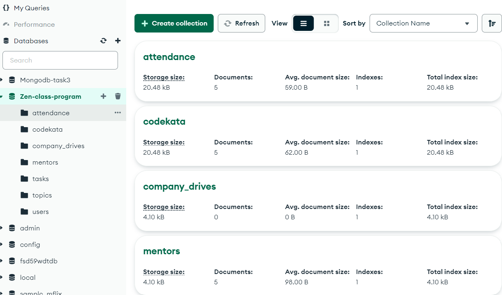
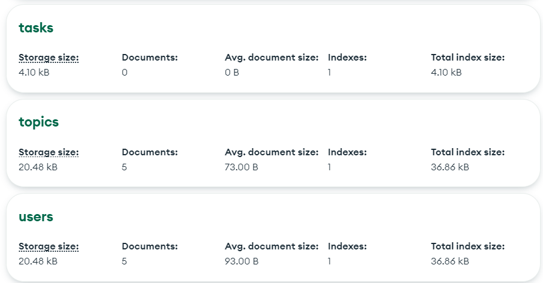

# MongoDB Task

# Design database for Zen class programme

## Tables

1. **users**
2. **codekata**
3. **attendance**
4. **topics**
5. **tasks**
6. **company_drives**
7. **mentors**

1. Find all the topics and tasks which are thought in the month of October 
  >db.topics.aggregate([{$lookup: {
from: 'tasks',
localField: 'topic_id',
foreignField: 'task_id',
as: 'taskinfo'}},
{
$match: {$and: [
{ topic_date: { $gte: new Date("2021–10–01"), $lt: new Date("2021–10–30") } },
{$or: [
   { "taskinfo.due_date": { $gte: new Date("2021–10–01"), $lte: new Date("2021–10–30") } },
   { "taskinfo.due_date": { $exists: false } }]}]}},
   {
   $project: {
_id: 0,
topic_id: 1,
topic: 1,
topic_date: 1,
due_date: "$taskinfo.due_date"
   }}]);

1. Find all the company drives which appeared between 15 oct-2020 and 31-oct-2020

   > db.company_drives.find({ $or: [{ drive_date: { $gte: new Date("2021-10-15") ,$lte: new Date("2021-10-31")} }]});

2. Find all the company drives and students who are appeared for the placement

3. Find the number of problems solved by the user in codekata

4. Find all the mentors with who has the mentee's count more than 15
   > db.mentors.find({mentee_count:{$gte:15}});
5. Find the number of users who are absent and task is not submitted between 15 oct-2020 and 31-oct-2020
